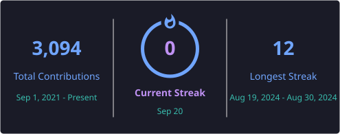

# Aadil Kadiwal

### Senior Software Engineer · Django · Vue 3 · Cloud · Mumbai

---

## About

- Senior Software Engineer at [@pixeldust-in](https://github.com/pixeldust-in) — **lead engineer on two fintech products**, and I own the release pipeline on both.
- Five years on **Python** and **Django**, and usually the **Vue 3** front end and the deployment as well.
- End to end means end to end: DRF services, Vue dashboards, Docker images pinned to fixed versions and running as non-root, **GitHub Actions** for the release, Nginx with automatic HTTPS, secrets in Doppler.
- Work across **AWS, Azure and GCP** — including an internal platform that folds all three bills into a single cost model.
- I mentor through code review rather than rewriting branches. One intern went from first commit to owning a platform feature in six months.

---

## Selected Work

**Multi-Cloud Cost Platform** — AWS, Azure and GCP bills in one **Vue 3** dashboard instead of three provider consoles. Daily imports and forecasts run on scheduled **Celery** jobs.

**Investor Relations Platform** — target lists, roadshows, research coverage and documents on **S3**, where each user sees only what their role allows (JWT auth). Sole author of the invitation and onboarding flow.

**Proxy Voting — custodian module** — institutions vote on behalf of their investors. Every investor, scheme, holdings file and e-voting upload needs a second person's approval across **six roles**, and the system checks who held the shares on the record date.

**Partner Platform, Fortune 50 FMCG** — grew it from **20K to 160K** monthly users. The site was never the bottleneck; agencies were waiting on emailed reports. Gave each agency its own trackable links, then a dashboard they pulled their own numbers from.

**Platform hardening** — upgraded **10 PostgreSQL** databases from v11 to v17, about **9 million** records across 30+ tables, one at a time with rollback plans and **no data loss**. Cut API response times by roughly **40%** with Redis caching, targeted indexes and read-replica queries.

---

## Tech

**Languages**

**Backend**

**Frontend**

**Cloud**

**DevOps & Quality**

---

## Projects

**[Equity Research Journal](https://equity-research-journal.pages.dev)** — *Astro · Cloudflare Pages Functions · Python · GitHub Actions*

Brokerage apps give you a few hundred characters for notes, which is not enough room to write down *why*. Every company I read gets a file here instead: the view in plain English, a multibagger score out of 100, and an AI-written report on the earnings call. Read it again next quarter and the old call stays put, so a change of mind is part of the record. No database and no server — a scheduled **GitHub Actions** job recalculates the price trends after market close and commits only what changed.

---

## Certification

**Claude Certified Architect — Foundations**, Anthropic · September 2026

---

## GitHub

> These two cards are generated daily by [a GitHub Actions workflow](.github/workflows/profile-cards.yml) in this
> repository and committed as static SVGs, so nothing outside GitHub sits in the request path when someone loads this
> page. The workflow uses a personal access token, which is what allows private contributions to be counted.

---

*Most of my recent work lives in private organisation repositories, which the stats above include.*

